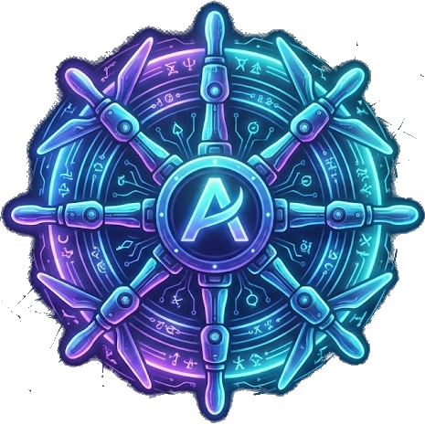

<p align="center">
  
</p>

<h1 align="center">AgentOps</h1>

<p align="center">
  <a href="https://github.com/samyn92/agentops-platform/releases"></a>
  <a href="https://github.com/samyn92/agentops-core/releases"></a>
  <a href="https://github.com/samyn92/agentops-runtime/releases"></a>
  <a href="https://github.com/samyn92/agentops/actions/workflows/deploy-pages.yml"></a>
  <a href="LICENSE"></a>
</p>

<p align="center">
  Kubernetes-native AI agent platform. Memory, delegation, observability.
</p>

<p align="center">
  <a href="https://samyn92.github.io/agentops/">Documentation</a> · <a href="https://samyn92.github.io/agentops/docs/getting-started/">Getting Started</a> · <a href="https://github.com/samyn92/agentops-core">Operator</a> · <a href="https://github.com/samyn92/agentops-runtime">Runtime</a>
</p>

---

Deploy AI agents as first-class Kubernetes workloads. Define agents, tools, channels, and resources as Custom Resources — the operator handles deployments, networking, storage, MCP tool integration, and a purpose-built memory system with relevance-ranked context injection.

Built on the [Charm Fantasy SDK](https://github.com/charmbracelet/fantasy). Pure Go. No Python runtime.

## Architecture

<p align="center">
  
</p>

## Platform Components

| Repository | Description | Latest |
|:--|:--|:--|
| [agentops-core](https://github.com/samyn92/agentops-core) | Kubernetes operator — 6 CRDs, MCP gateway sidecars, RBAC, concurrency control | [](https://github.com/samyn92/agentops-core/releases) |
| [agentops-runtime](https://github.com/samyn92/agentops-runtime) | Fantasy SDK agent binary — three-layer memory, delegation, FEP streaming | [](https://github.com/samyn92/agentops-runtime/releases) |
| [agentops-console](https://github.com/samyn92/agentops-console) | Go BFF + SolidJS PWA — real-time streaming, 60+ API endpoints, trace integration | [](https://github.com/samyn92/agentops-console/releases) |
| [agentops-memory](https://github.com/samyn92/agentops-memory) | Purpose-built memory service — SQLite + FTS5 BM25, three-tier write dedup | [](https://github.com/samyn92/agentops-memory/releases) |
| [agent-tools](https://github.com/samyn92/agent-tools) | MCP tool servers (kubectl, kube-explore, git, github, gitlab, flux) + OCI CLI | [](https://github.com/samyn92/agent-tools/releases) |
| [agentops-platform](https://github.com/samyn92/agentops-platform) | Umbrella Helm chart — one-command full-stack deployment | [](https://github.com/samyn92/agentops-platform/releases) |
| [agent-channels](https://github.com/samyn92/agent-channels) | Webhook and GitLab bridge channel images | [](https://github.com/samyn92/agent-channels/releases) |

## Key Features

### Three-Layer Memory

Agents remember across conversations and learn from experience.

- **Working Memory** — Last N turns in runtime memory, crash-checkpointed to PVC
- **Short-term Memory** — Deterministic session summaries (no LLM call), injected on each turn
- **Long-term Memory** — Decisions, discoveries, lessons learned. BM25 relevance-ranked context injection with three-tier write dedup

Every memory injection is recorded as an OTEL span — you can trace exactly which memories influenced each response.

### Parallel Agent Delegation

The `run_agents` tool dispatches to multiple agents in one call. A `DelegationWatcher` uses Kubernetes Watch (zero polling) to track child runs and callback when all complete. The parent agent stays idle during the wait.

### MCP Gateway Sidecar

Each agent pod gets a permission-enforcing MCP gateway sidecar. Tools are distributed as custom OCI artifacts, pulled by init containers, and accessed via Streamable HTTP through the gateway.

### Real-Time Console

SolidJS PWA with FEP/SSE streaming, 12 specialized tool card renderers, Tempo trace integration with delegation tree enrichment, and a memory management panel.

### Full OTEL Observability

Every agent turn, tool invocation, memory read/write, and delegation is traced end-to-end with OpenTelemetry. Per-observation injection audit trails show exactly which memories were injected and why.

## Quickstart

```bash
# Install the platform
helm install agentops oci://ghcr.io/samyn92/charts/agentops-platform \
  --namespace agent-system --create-namespace

# Deploy an agent
kubectl apply -f https://raw.githubusercontent.com/samyn92/agentops-platform/main/presets/coding-assistant/tools.yaml
kubectl apply -f https://raw.githubusercontent.com/samyn92/agentops-platform/main/presets/coding-assistant/agent.yaml

# Access the console
kubectl port-forward -n agent-system svc/agentops-console 8080:80
```

## Define an Agent

```yaml
apiVersion: agents.agentops.io/v1alpha1
kind: Agent
metadata:
  name: platform-engineer
  namespace: agents
spec:
  mode: daemon
  model:
    name: kimi/kimi-k2.5
  systemPrompt: |
    You are a platform engineering agent...
  toolRefs:
    - name: kubectl
    - name: kube-explore
    - name: git
    - name: github
  memory:
    serverRef: agentops-memory
  delegation:
    visibility: namespace
    allowedCallers: ["orchestrator"]
  runtime:
    image: ghcr.io/samyn92/agentops-runtime-fantasy:0.8.4
```

## Documentation

Full documentation at **[samyn92.github.io/agentops](https://samyn92.github.io/agentops/)**

- [Getting Started](https://samyn92.github.io/agentops/docs/getting-started/)
- [Concepts](https://samyn92.github.io/agentops/docs/concepts/)
- [Guides](https://samyn92.github.io/agentops/docs/guides/)
- [API Reference](https://samyn92.github.io/agentops/docs/reference/)

## Project Status

AgentOps is under active development. Running in production on local k3s clusters with 8 agents deployed (3 daemon, 5 task).

Current focus: AgentSkill CRD, Trigger CRD, Workflow CRD, tool display branding.

See the [Roadmap](https://samyn92.github.io/agentops/docs/project/roadmap/) for details.

---

<p align="center">
  <sub>Apache License 2.0</sub>
</p>
