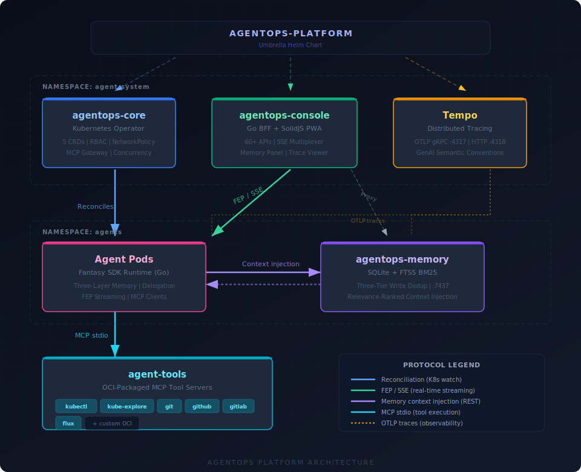

# AgentOps

**Kubernetes-native AI agent platform with memory, delegation, and observability.**

AgentOps is an open-source platform for deploying AI agents as native Kubernetes workloads. Define agents, tools, channels, and resources as Custom Resources — the operator handles deployments, networking, storage, MCP tool integration, and a purpose-built memory system with relevance-ranked context injection.

> Built on the [Charm Fantasy SDK](https://github.com/charmbracelet/fantasy). Pure Go. No Python runtime.

---

## Why AgentOps?

| Capability | AgentOps | kagent |
|-----------|----------|--------|
| **Runtime** | Go binary (Fantasy SDK) | Python (Google ADK) |
| **Memory** | Three-layer system (working/short-term/long-term) with BM25 relevance ranking | None |
| **Agent delegation** | Parallel fan-out with zero-polling K8s Watch | Single agent per task |
| **Tool distribution** | Custom OCI artifacts + MCP stdio | Container images + MCP |
| **Observability** | Per-observation OTEL injection audit trails | Basic OTEL tracing |
| **Streaming** | FEP protocol (30+ event types) | Standard API |
| **Console** | SolidJS PWA with real-time streaming, 12 tool card renderers | React UI |
| **Memory service** | SQLite + FTS5, three-tier write dedup, ~1300 LOC | N/A |

---

## Architecture

<p align="center">
  
</p>

---

## Components

| Repository | Description | Version |
|-----------|-------------|---------|
| [agentops-core](https://github.com/samyn92/agentops-core) | Kubernetes operator — 5 CRDs, MCP gateway sidecars, RBAC, concurrency control | v0.8.1 |
| [agentops-runtime](https://github.com/samyn92/agentops-runtime) | Fantasy SDK agent binary — three-layer memory, delegation, FEP streaming | v0.8.2 |
| [agentops-console](https://github.com/samyn92/agentops-console) | Go BFF + SolidJS PWA — real-time streaming, 60+ API endpoints, trace integration | v0.9.4 |
| [agentops-memory](https://github.com/samyn92/agentops-memory) | Purpose-built memory service — SQLite + FTS5 BM25, three-tier write dedup | v0.2.0 |
| [agent-tools](https://github.com/samyn92/agent-tools) | MCP tool servers (kubectl, kube-explore, git, github, gitlab, flux) + OCI CLI | v0.5.1 |
| [agentops-platform](https://github.com/samyn92/agentops-platform) | Umbrella Helm chart — one-command full-stack deployment | v0.9.6 |
| [agent-channels](https://github.com/samyn92/agent-channels) | Webhook and GitLab bridge channel images | v0.1.0 |

---

## Key Features

### Three-Layer Memory System

Agents remember across conversations and learn from experience.

- **Working Memory** — Last N turns in runtime memory (crash-checkpointed to PVC)
- **Short-term Memory** — Deterministic session summaries (no LLM call), injected on each turn
- **Long-term Memory** — Decisions, discoveries, lessons learned. BM25 relevance-ranked context injection. Three-tier write dedup (topic_key upsert, hash dedup, new insert)

Every memory injection is recorded as an OTEL span event — you can see in Tempo exactly which memories influenced each agent response.

### Parallel Agent Delegation

The `run_agents` tool dispatches to multiple agents in one call. A `DelegationWatcher` uses K8s Watch (zero polling, zero CPU) to track child runs and automatically callbacks when all complete. The parent agent stays idle and available during the wait.

### Intent-Based Kubernetes Tools

`kube-explore` replaces 3-10 kubectl commands with single intent-based calls:

- `kube_find` — Fuzzy search across all namespaces and resource types
- `kube_health` — Full cluster health snapshot (HEALTHY/DEGRADED/CRITICAL)
- `kube_inspect` — Deep resource inspection with logs, events, owner chain, related resources
- `kube_topology` — Relationship graph as a tree structure

### MCP Gateway Sidecar

Each agent pod gets a permission-enforcing MCP gateway sidecar. Tools are distributed as custom OCI artifacts (`application/vnd.agents.io.mcp-tool.v1`), pulled by init containers, and accessed via Streamable HTTP through the gateway.

### Real-Time Console

SolidJS PWA with FEP/SSE streaming, 12 specialized tool card renderers (Terminal, Diff, Code, FileTree, Kubernetes, Helm, DelegationFanOut, etc.), Tempo trace integration with delegation tree enrichment, and a memory management panel.

---

## Quickstart

```bash
# Add the chart repo
helm install agentops oci://ghcr.io/samyn92/charts/agentops-platform \
  --namespace agent-system --create-namespace

# Deploy an agent
kubectl apply -f https://raw.githubusercontent.com/samyn92/agentops-platform/main/presets/coding-assistant/tools.yaml
kubectl apply -f https://raw.githubusercontent.com/samyn92/agentops-platform/main/presets/coding-assistant/agent.yaml

# Access the console
kubectl port-forward -n agent-system svc/agentops-console 8080:80
# Open http://localhost:8080
```

For the full installation guide, see the [documentation](https://samyn92.github.io/agentops/docs/).

---

## Custom Resource Examples

### Agent

```yaml
apiVersion: agents.agentops.io/v1alpha1
kind: Agent
metadata:
  name: platform-engineer
  namespace: agents
spec:
  mode: daemon
  model:
    name: kimi/kimi-k2.5
  systemPrompt: |
    You are a platform engineering agent...
  toolRefs:
    - name: kubectl
    - name: kube-explore
    - name: git
    - name: github
  memory:
    serverRef: agentops-memory
  delegation:
    visibility: namespace
    allowedCallers: ["orchestrator"]
  runtime:
    image: ghcr.io/samyn92/agentops-runtime-fantasy:0.8.2
```

### AgentTool (OCI)

```yaml
apiVersion: agents.agentops.io/v1alpha1
kind: AgentTool
metadata:
  name: kube-explore
  namespace: agents
spec:
  type: oci
  oci:
    ref: ghcr.io/samyn92/agent-tools/kube-explore:0.5.1
  env:
    - name: MODE
      value: readwrite
```

---

## Documentation

Full documentation is available at **[samyn92.github.io/agentops](https://samyn92.github.io/agentops/)**.

- [Getting Started](https://samyn92.github.io/agentops/docs/getting-started/)
- [Concepts](https://samyn92.github.io/agentops/docs/concepts/)
- [Guides](https://samyn92.github.io/agentops/docs/guides/)
- [API Reference](https://samyn92.github.io/agentops/docs/reference/)

---

## Project Status

AgentOps is under active development. The platform is functional and running in production on local k3s clusters with 8 agents deployed.

Current focus areas:
- AgentSkill CRD (curated knowledge with Git sync and OCI sources)
- Trigger CRD (unified entry point replacing Channel)
- Workflow CRD (declarative DAG execution with gates and conditions)
- Tool display branding and custom card renderers

See the [Roadmap](https://samyn92.github.io/agentops/docs/project/roadmap/) for details.

---

## License

[Apache License 2.0](LICENSE)
